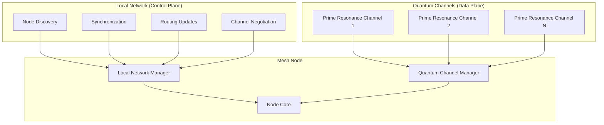

# Quantum Mesh Network

A secure mesh networking system that combines local network coordination with quantum non-local communication channels. This implementation demonstrates a hybrid architecture where sensitive user data travels exclusively through quantum channels while coordination and synchronization occur over traditional local networks.

## 🚀 Quick Start

```javascript
import { QuantumMeshNode } from './index.js';

// Create a mesh node
const node = new QuantumMeshNode('alice', {
  networkId: 'my-secure-network',
  enableEncryption: true,
  securityLevel: 'standard'
});

// Join the mesh network
await node.join();

// Send a secure message to another node
await node.sendMessage('bob', 'Hello Bob, this message travels via quantum channel!');

// Broadcast to all connected nodes
await node.broadcastMessage('Hello everyone!');

// Leave the network
await node.leave();
```

## 🏗️ Architecture Overview

### Hybrid Design Principles

1. **Control Plane (Local Network)**: Handles node discovery, synchronization, routing updates, and channel negotiation
2. **Data Plane (Quantum Channels)**: Transmits actual user messages through prime resonance communication
3. **Complete Separation**: User data NEVER touches the local network infrastructure



## 🔧 Installation & Setup

### Prerequisites

- Node.js 18+
- Access to the parent prime-tunnel-communication module

### Running the Demo

```bash
# Navigate to the secure communications directory
cd examples/secure-communications

# Run the simple mesh demo
node examples/simple-mesh-demo.js
```

This will create three nodes (Alice, Bob, Charlie) and demonstrate:
- Network discovery and quantum channel establishment
- Point-to-point secure messaging
- Broadcast messaging
- Network health monitoring

## 📚 Core Components

### QuantumMeshNode

The main class that orchestrates mesh networking functionality.

```javascript
import { QuantumMeshNode } from './index.js';

const node = new QuantumMeshNode('nodeId', {
  networkId: 'my-network',
  enableEncryption: true,
  securityLevel: 'high_security',
  verbose: true
});

// Event handling
node.on('node-joined', (data) => {
  console.log(`Node ${data.nodeId} joined the network`);
});

node.on('message-received', (data) => {
  console.log(`Received: "${data.data}" from ${data.sourceNodeId}`);
});

node.on('channel-established', (data) => {
  console.log(`Quantum channel established to ${data.remoteNodeId}`);
});
```

### LocalNetworkManager

Handles control plane communications - discovery, synchronization, routing.

**Key Features:**
- UDP-based node discovery
- Clock synchronization
- Quantum channel negotiation
- Network topology management
- **NO USER DATA** - control messages only

### QuantumChannelManager

Manages quantum communication channels using prime resonance.

**Key Features:**
- Prime-based quantum channels
- Health monitoring and heartbeats
- Message chunking and reassembly
- Error recovery and redundancy
- Channel isolation for security

## 🔒 Security Features

### Complete Data Plane Isolation

```javascript
// This message ONLY travels through quantum channels
await node.sendMessage('targetNode', 'Top secret information');

// Local network only sees:
// - That a channel negotiation occurred
// - Channel health status
// - Routing information
// - NO MESSAGE CONTENT
```

### Multi-Level Security

```javascript
// Standard security (32 smaller primes)
const standardNode = new QuantumMeshNode('node1', {
  securityLevel: 'standard'
});

// High security (32 larger primes)
const secureNode = new QuantumMeshNode('node2', {
  securityLevel: 'high_security'
});
```

### Quantum Channel Properties

- **Prime Resonance Based**: Uses actual pulsar frequency data
- **Non-Local Communication**: Messages don't traverse traditional network paths
- **Perfect Forward Secrecy**: Each channel uses unique prime sets
- **Quantum Entanglement Simulation**: Synchronized quantum state evolution

## 📊 Network Monitoring

### Real-time Statistics

```javascript
const stats = node.getStatistics();

console.log(stats);
// Output:
// {
//   node: { nodeId, networkId, isActive, uptime },
//   messages: { sent, received },
//   network: { knownNodes, connectedNodes, quantumChannels },
//   performance: { errors, channelsEstablished },
//   details: { local: {...}, quantum: {...} }
// }
```

### Health Monitoring

```javascript
const health = await node.performHealthCheck();

// Check individual channel health
const channelHealth = node.getChannelHealth('targetNodeId');
console.log(channelHealth.successRate); // 0.0 - 1.0
console.log(channelHealth.latency);     // Average latency in ms
```

## 🌐 Network Events

The system emits various events for monitoring and integration:

```javascript
node.on('node-joined', ({ nodeId }) => {
  console.log(`${nodeId} joined the network`);
});

node.on('node-left', ({ nodeId, reason }) => {
  console.log(`${nodeId} left: ${reason}`);
});

node.on('channel-established', ({ remoteNodeId, channelId }) => {
  console.log(`Quantum channel ${channelId} established`);
});

node.on('message-received', ({ sourceNodeId, data, timestamp }) => {
  console.log(`Message from ${sourceNodeId}: ${data}`);
});

node.on('error-occurred', ({ type, error }) => {
  console.error(`Network error: ${type} - ${error}`);
});
```

## ⚙️ Configuration

### Network Configuration

```javascript
const config = {
  // Network Identity
  networkId: 'production-mesh',
  nodeId: 'server-01',
  
  // Security Settings
  enableEncryption: true,
  securityLevel: 'high_security', // 'standard' | 'high_security'
  
  // Local Network (Control Plane)
  localNetwork: {
    discoveryPort: 8080,
    heartbeatInterval: 5000,
    nodeTimeout: 15000
  },
  
  // Quantum Channels (Data Plane)
  quantumChannels: {
    defaultPrimeCount: 32,
    maxConcurrentChannels: 16,
    healthCheckInterval: 10000,
    minSuccessRate: 0.7
  },
  
  // Quantum Physics Parameters
  quantum: {
    epsilon: 0.4,              // Phase encoding strength
    threshold: 0.25,           // Decoding threshold
    messageForce: 25,          // Message attractor strength
    enablePhaseCorrection: true
  }
};

const node = new QuantumMeshNode('myNode', config);
```

### Prime Set Configuration

```javascript
// Custom prime sets for different security levels
const customConfig = {
  primes: {
    standard: [1009, 1013, 1019, ...], // 32 primes
    high_security: [1229, 1231, 1237, ...], // 32 larger primes
    custom: [your, custom, prime, set]
  }
};
```

## 🔬 Technical Details

### Message Flow

1. **User sends message** → Node A
2. **Channel negotiation** → Local network coordination
3. **Quantum encoding** → Prime resonance modulation
4. **Non-local transmission** → Quantum channel (NO local network)
5. **Quantum decoding** → Prime resonance demodulation
6. **Message delivery** → Node B

### Prime Resonance Communication

The system uses the existing prime tunnel communication technology:

- **Prime Bases**: Each node uses a set of prime numbers as quantum bases
- **Pulsar Frequencies**: Real pulsar data provides frequency information
- **Phase Encoding**: Messages encoded as phase shifts in prime bases
- **Quantum Evolution**: Simulated quantum state evolution maintains entanglement

### Network Protocols

#### Control Messages (Local Network)
- `NODE_DISCOVERY`: Find other nodes on network
- `SYNCHRONIZATION`: Clock and quantum state sync
- `CHANNEL_NEGOTIATION`: Setup quantum channel parameters
- `HEARTBEAT`: Keep-alive and health monitoring
- `ROUTING_UPDATE`: Network topology changes

#### Quantum Messages (Quantum Channels)
- `DATA_PACKET`: User message content
- `QUANTUM_HANDSHAKE`: Channel establishment
- `HEARTBEAT_Q`: Quantum channel health
- `ACKNOWLEDGMENT`: Message confirmation

## 🚀 Advanced Usage

### Custom Message Handling

```javascript
class SecureChatNode extends QuantumMeshNode {
  constructor(nodeId, config) {
    super(nodeId, config);
    
    this.on('message-received', this.handleChatMessage.bind(this));
  }
  
  handleChatMessage({ sourceNodeId, data, timestamp }) {
    // Process incoming chat message
    console.log(`[${new Date(timestamp).toLocaleTimeString()}] ${sourceNodeId}: ${data}`);
    
    // Auto-reply example
    if (data.includes('ping')) {
      this.sendMessage(sourceNodeId, 'pong');
    }
  }
  
  async sendChatMessage(targetNodeId, message) {
    const formattedMessage = `[${this.nodeId}]: ${message}`;
    return await this.sendMessage(targetNodeId, formattedMessage);
  }
}
```

### Network Monitoring Dashboard

```javascript
import { QuantumMeshNode } from './index.js';

class NetworkMonitor {
  constructor() {
    this.nodes = new Map();
  }
  
  addNode(node) {
    this.nodes.set(node.getNodeId(), node);
    
    node.on('*', (eventName, data) => {
      this.logEvent(node.getNodeId(), eventName, data);
    });
  }
  
  getNetworkTopology() {
    const topology = { nodes: [], connections: [] };
    
    for (const [nodeId, node] of this.nodes) {
      topology.nodes.push({
        id: nodeId,
        status: node.isConnected() ? 'connected' : 'disconnected',
        connections: node.getConnectedNodes()
      });
    }
    
    return topology;
  }
  
  getNetworkStatistics() {
    const stats = { totalNodes: 0, totalChannels: 0, totalMessages: 0 };
    
    for (const [nodeId, node] of this.nodes) {
      const nodeStats = node.getStatistics();
      stats.totalNodes++;
      stats.totalChannels += nodeStats.network.quantumChannels;
      stats.totalMessages += nodeStats.messages.sent + nodeStats.messages.received;
    }
    
    return stats;
  }
}
```

## 🧪 Testing

### Unit Tests

```bash
# Run network protocol tests
npm test network-protocol

# Run quantum channel tests
npm test quantum-channels

# Run mesh node integration tests
npm test mesh-integration
```

### Integration Testing

```javascript
import { QuantumMeshNode, MeshNetworkDemo } from './index.js';

async function testMeshNetwork() {
  const demo = new MeshNetworkDemo();
  
  // Create test network
  await demo.createNode('test1');
  await demo.createNode('test2');
  await demo.startNetwork();
  
  // Test messaging
  await demo.sendMessage('test1', 'test2', 'Test message');
  
  // Verify delivery
  const node2 = demo.getNode('test2');
  const stats = node2.getStatistics();
  assert(stats.messages.received > 0, 'Message should be received');
  
  await demo.stopNetwork();
}
```

## 🛠️ Troubleshooting

### Common Issues

1. **Nodes not discovering each other**
   - Check firewall settings for UDP port 8080
   - Ensure nodes are on the same network segment
   - Verify networkId matches across nodes

2. **Quantum channels failing to establish**
   - Check prime set compatibility
   - Verify quantum parameters are synchronized
   - Monitor error logs for specific failure reasons

3. **Messages not being delivered**
   - Check channel health status
   - Verify target node is connected
   - Monitor quantum channel statistics

### Debug Mode

```javascript
const node = new QuantumMeshNode('debug-node', {
  verbose: true,        // Enable detailed logging
  quantum: {
    verbose: true       // Enable quantum layer logging
  }
});
```

## 🔮 Future Enhancements

- **Multi-hop Routing**: Route messages through intermediate nodes
- **Channel Redundancy**: Multiple quantum channels per node pair
- **Load Balancing**: Distribute traffic across available channels
- **Encryption**: Additional encryption layers on quantum channels
- **Performance Optimization**: Faster channel establishment and messaging
- **Real Quantum Hardware**: Integration with actual quantum computers

## 📄 License

This project extends the prime-tunnel-communication library and maintains the same ISC license.

---

**Built on Prime Tunnel Communication Technology** - Leveraging real pulsar data and prime number theory for secure quantum mesh networking.