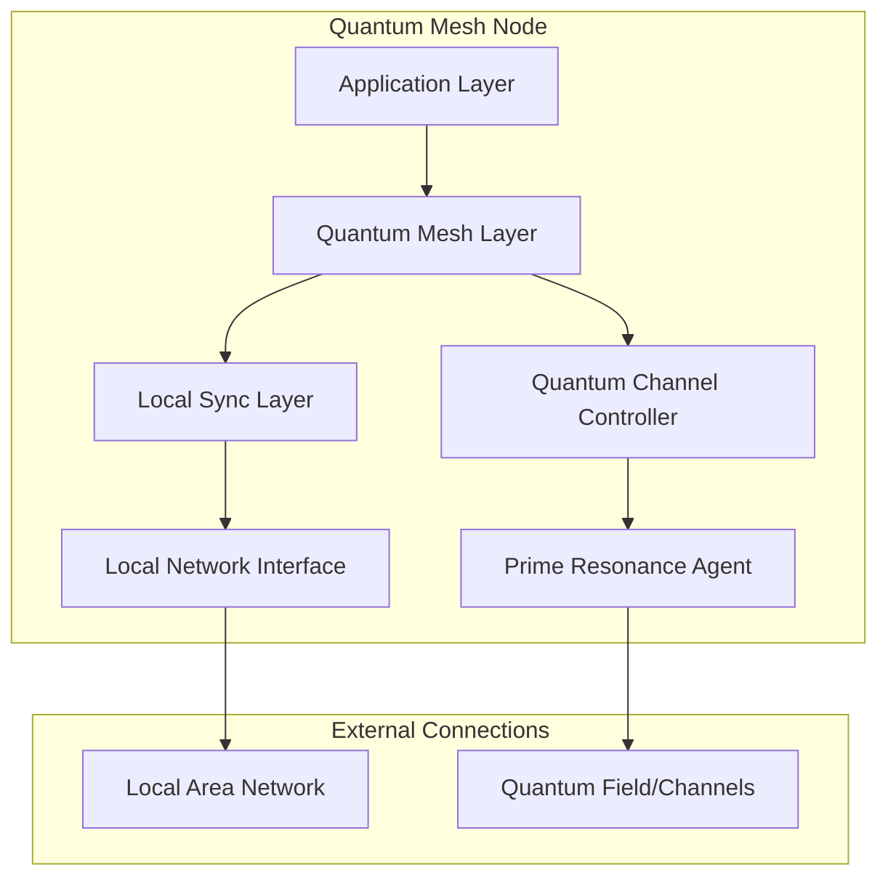
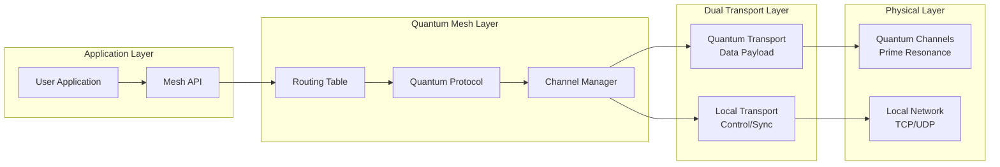
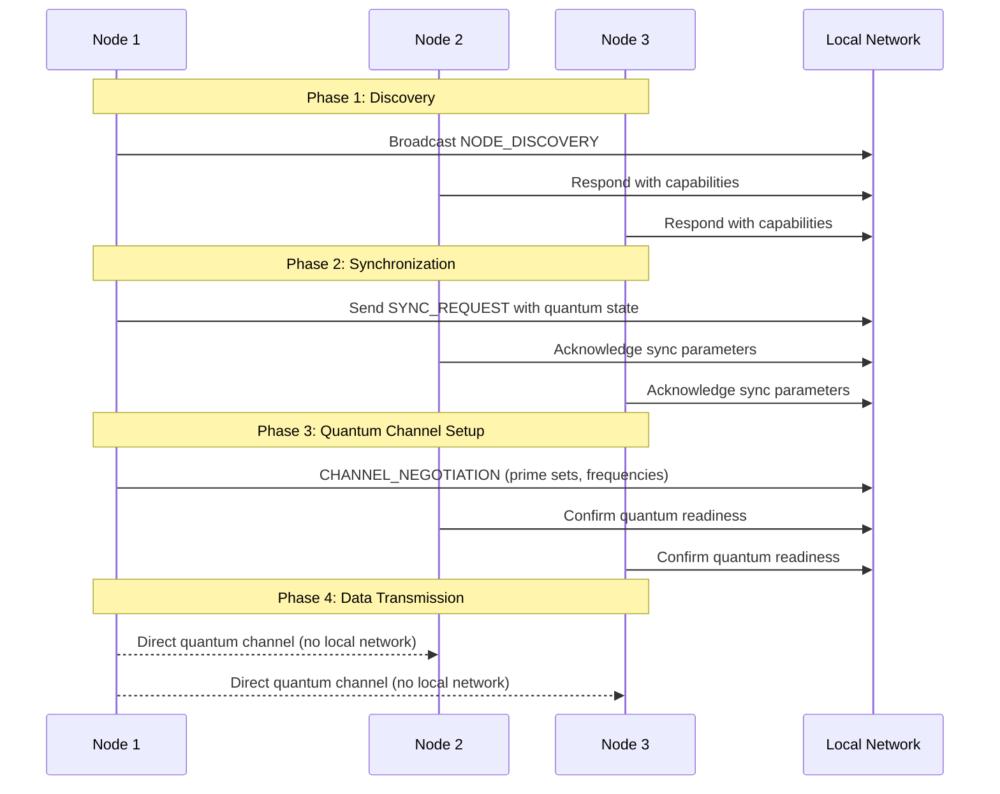
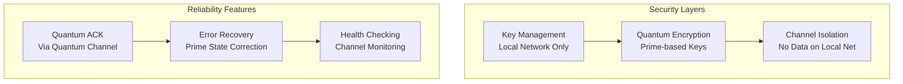

# Non-Local Quantum Communication Mesh Network Architecture

## Overview

This document outlines the design and implementation plan for a hybrid mesh network that leverages quantum non-local communication through prime resonance. The architecture separates control plane operations (handled by local networking) from data plane operations (handled by quantum channels), ensuring that sensitive user data never touches traditional network infrastructure.

## Architecture Principles

1. **Hybrid Design**: Local network handles synchronization and coordination; quantum channels handle data transmission
2. **Mesh Topology**: Full connectivity where any node can communicate directly with any other node
3. **Security by Design**: User data never traverses local networks
4. **Prime Resonance Foundation**: Built on existing [`prime-resonance.js`](../../src/prime-resonance.js) and [`core.js`](../../src/core.js) implementations

## System Architecture

### High-Level Node Architecture



### Network Stack Design



## Protocol Design

### Control Plane Protocol (Local Network)

The local network handles metadata and synchronization only:

```javascript
const CONTROL_MESSAGE_TYPES = {
  NODE_DISCOVERY: 'discovery',        // Node announcement and capabilities
  SYNCHRONIZATION: 'sync',            // Clock and quantum state sync
  ROUTING_UPDATE: 'routing',          // Mesh topology updates
  CHANNEL_NEGOTIATION: 'channel_nego', // Quantum channel setup
  HEARTBEAT: 'heartbeat',             // Node health monitoring
  QUANTUM_READINESS: 'q_ready'        // Quantum channel status
};
```

### Data Plane Protocol (Quantum Channels)

User data flows exclusively through quantum channels:

```javascript
const QUANTUM_MESSAGE_TYPES = {
  DATA_PACKET: '000',           // Regular user data
  ACKNOWLEDGMENT: '001',        // Quantum ACK
  QUANTUM_HANDSHAKE: '010',     // Channel establishment
  CHANNEL_TEST: '011',          // Channel health check
  ENCRYPTED_DATA: '100'         // Encrypted user data
};
```

### Node Synchronization Flow



## Implementation Components

### Core Node Manager

```javascript
class QuantumMeshNode {
  constructor(nodeId, config) {
    this.nodeId = nodeId;
    this.localNetworkManager = new LocalNetworkManager();
    this.quantumChannelManager = new QuantumChannelManager();
    this.routingTable = new MeshRoutingTable();
    this.synchronizer = new NodeSynchronizer();
    this.isActive = false;
  }
  
  async join(networkId) {
    // 1. Discover existing nodes via local network
    // 2. Synchronize clocks and quantum states
    // 3. Establish quantum channels to all nodes
    // 4. Update mesh routing table
  }
  
  async sendMessage(targetNodeId, data) {
    // Route message via quantum channel only
    const channel = this.quantumChannelManager.getChannel(targetNodeId);
    return await channel.sendQuantumData(data);
  }
  
  async broadcastMessage(data) {
    // Send to all connected nodes via quantum channels
    const promises = [];
    for (const nodeId of this.routingTable.getAllNodes()) {
      promises.push(this.sendMessage(nodeId, data));
    }
    return await Promise.all(promises);
  }
  
  async leave() {
    // Gracefully disconnect from mesh
    await this.localNetworkManager.announceLeaving();
    await this.quantumChannelManager.closeAllChannels();
  }
}
```

### Quantum Channel Manager

```javascript
class QuantumChannelManager {
  constructor(nodeId) {
    this.nodeId = nodeId;
    this.channels = new Map(); // nodeId -> EnhancedCommunicationAgent
    this.channelStates = new Map();
    this.channelHealth = new Map();
  }
  
  async establishChannel(targetNodeId, primeSet, config) {
    // Create dedicated quantum agent for this node pair
    const agent = new EnhancedCommunicationAgent(primeSet, config);
    
    // Perform quantum handshake
    await this.performQuantumHandshake(agent, targetNodeId);
    
    this.channels.set(targetNodeId, agent);
    this.channelHealth.set(targetNodeId, {
      lastHeartbeat: Date.now(),
      successRate: 1.0,
      latency: 0
    });
    
    return agent;
  }
  
  async sendQuantumData(targetNodeId, data) {
    const channel = this.channels.get(targetNodeId);
    if (!channel) {
      throw new Error(`No quantum channel to node ${targetNodeId}`);
    }
    
    // Use existing chunking protocol from messaging.js
    const result = await sendMessage({
      fullMessageString: data,
      messageType: QUANTUM_MESSAGE_TYPES.DATA_PACKET,
      senderAgent: channel,
      receiverAgent: this.getRemoteAgent(targetNodeId),
      chatConfig: this.getChannelConfig(targetNodeId)
    });
    
    // Update channel health metrics
    this.updateChannelHealth(targetNodeId, result);
    
    return result;
  }
  
  async performQuantumHandshake(agent, targetNodeId) {
    // Establish quantum entanglement using prime resonance
    // Verify channel integrity
    // Exchange quantum keys if encryption is enabled
  }
  
  getChannel(nodeId) {
    return this.channels.get(nodeId);
  }
  
  async closeAllChannels() {
    for (const [nodeId, channel] of this.channels) {
      await this.closeChannel(nodeId);
    }
  }
  
  async closeChannel(nodeId) {
    const channel = this.channels.get(nodeId);
    if (channel) {
      // Graceful quantum channel termination
      this.channels.delete(nodeId);
      this.channelHealth.delete(nodeId);
    }
  }
}
```

### Local Network Manager

```javascript
class LocalNetworkManager {
  constructor(nodeId, port = 8080) {
    this.nodeId = nodeId;
    this.port = port;
    this.knownNodes = new Map();
    this.server = null;
    this.clients = new Map();
  }
  
  async start() {
    // Start local network server for control messages
    this.server = this.createControlServer();
    await this.discoverNodes();
  }
  
  async discoverNodes() {
    // Broadcast discovery message on local network
    const discoveryMessage = {
      type: CONTROL_MESSAGE_TYPES.NODE_DISCOVERY,
      nodeId: this.nodeId,
      capabilities: this.getNodeCapabilities(),
      timestamp: Date.now()
    };
    
    await this.broadcast(discoveryMessage);
  }
  
  async synchronizeWith(targetNodeId) {
    // Exchange synchronization parameters
    const syncMessage = {
      type: CONTROL_MESSAGE_TYPES.SYNCHRONIZATION,
      nodeId: this.nodeId,
      quantumState: this.getQuantumStateHash(),
      clockOffset: this.getClockOffset(),
      primeConfiguration: this.getPrimeConfiguration()
    };
    
    return await this.sendToNode(targetNodeId, syncMessage);
  }
  
  async negotiateQuantumChannel(targetNodeId, primeSet) {
    // Coordinate quantum channel establishment
    const negotiationMessage = {
      type: CONTROL_MESSAGE_TYPES.CHANNEL_NEGOTIATION,
      sourceNodeId: this.nodeId,
      targetNodeId,
      primeSet,
      frequencies: this.getFrequencySet(primeSet),
      encryptionParams: this.getEncryptionParams()
    };
    
    return await this.sendToNode(targetNodeId, negotiationMessage);
  }
  
  createControlServer() {
    // WebSocket or UDP server for control messages
    // Handles discovery, sync, routing updates
    // NO USER DATA - control plane only
  }
}
```

### Mesh Routing Table

```javascript
class MeshRoutingTable {
  constructor(nodeId) {
    this.nodeId = nodeId;
    this.directChannels = new Map();
    this.nodeCapabilities = new Map();
    this.quantumReadiness = new Map();
    this.topology = new Map();
  }
  
  addDirectRoute(nodeId, channelInfo) {
    this.directChannels.set(nodeId, {
      ...channelInfo,
      established: Date.now(),
      lastUsed: Date.now()
    });
  }
  
  findBestRoute(targetNodeId) {
    // In mesh topology, prefer direct quantum channel
    if (this.directChannels.has(targetNodeId)) {
      return {
        type: 'direct',
        channel: this.directChannels.get(targetNodeId)
      };
    }
    
    // For future: multi-hop quantum routing
    return null;
  }
  
  updateTopology(discoveryData) {
    // Update mesh topology based on discovery messages
    for (const node of discoveryData.nodes) {
      this.nodeCapabilities.set(node.id, node.capabilities);
      this.quantumReadiness.set(node.id, node.quantumReady);
    }
  }
  
  getAllNodes() {
    return Array.from(this.directChannels.keys());
  }
  
  getActiveChannels() {
    return Array.from(this.directChannels.entries())
      .filter(([nodeId, info]) => info.active)
      .map(([nodeId, info]) => nodeId);
  }
}
```

## Security Architecture

### Security Layers



### Quantum Encryption Module

```javascript
class QuantumEncryption {
  constructor(primeSet) {
    this.primeSet = primeSet;
    this.quantumKeys = new Map();
  }
  
  generateQuantumKey(targetNodeId) {
    // Generate encryption key based on prime resonance
    const keyPrimes = this.selectKeyPrimes(targetNodeId);
    const quantumKey = this.deriveKeyFromPrimes(keyPrimes);
    this.quantumKeys.set(targetNodeId, quantumKey);
    return quantumKey;
  }
  
  encrypt(data, targetNodeId) {
    const key = this.quantumKeys.get(targetNodeId);
    if (!key) {
      throw new Error(`No quantum key for node ${targetNodeId}`);
    }
    
    // Prime-based quantum encryption
    return this.quantumCipher(data, key);
  }
  
  decrypt(encryptedData, sourceNodeId) {
    const key = this.quantumKeys.get(sourceNodeId);
    if (!key) {
      throw new Error(`No quantum key for node ${sourceNodeId}`);
    }
    
    return this.quantumDecipher(encryptedData, key);
  }
}
```

## Reliability & Error Handling

### Network Resilience Features

1. **Quantum Channel Redundancy**: Multiple prime sets per node pair
2. **Local Network Failover**: Alternative synchronization paths
3. **State Recovery**: Quantum state backup and restoration
4. **Node Failure Detection**: Heartbeat + quantum channel health monitoring

### Error Recovery Protocol

```javascript
class QuantumErrorRecovery {
  constructor(channelManager) {
    this.channelManager = channelManager;
    this.backupStates = new Map();
    this.recoveryAttempts = new Map();
  }
  
  async detectChannelFailure(nodeId) {
    const channel = this.channelManager.getChannel(nodeId);
    const health = this.channelManager.getChannelHealth(nodeId);
    
    if (health.successRate < 0.5 || health.lastHeartbeat < Date.now() - 30000) {
      return await this.initiateRecovery(nodeId);
    }
  }
  
  async initiateRecovery(nodeId) {
    // 1. Attempt to restore quantum state from backup
    // 2. Re-establish quantum channel with new prime set
    // 3. Verify channel integrity
    // 4. Resume data transmission
  }
}
```

## File Structure

```
examples/secure-communications/
├── README.md
├── quantum-mesh-network-architecture.md
├── src/
│   ├── network/
│   │   ├── mesh-node.js               # Core node implementation
│   │   ├── local-network-manager.js   # Local network control plane
│   │   ├── quantum-channel-manager.js # Quantum data plane
│   │   ├── routing-table.js           # Mesh routing logic
│   │   ├── node-synchronizer.js       # Clock and state sync
│   │   └── network-protocol.js        # Protocol definitions
│   ├── security/
│   │   ├── quantum-encryption.js      # Prime-based encryption
│   │   ├── key-management.js          # Local key distribution
│   │   └── channel-isolation.js       # Security enforcement
│   ├── utils/
│   │   ├── prime-utils.js             # Prime number utilities
│   │   ├── sync-utils.js              # Synchronization helpers
│   │   └── error-recovery.js          # Error handling utilities
│   └── config/
│       ├── network-config.js          # Network configuration
│       └── security-config.js         # Security parameters
├── examples/
│   ├── mesh-chat.js                   # Multi-node chat demo
│   ├── file-transfer.js               # Secure file transfer
│   ├── network-monitor.js             # Network visualization
│   └── simple-mesh.js                 # Basic mesh setup
├── tests/
│   ├── mesh-network.test.js           # Network functionality
│   ├── quantum-security.test.js       # Security validation
│   ├── performance.test.js            # Latency and throughput
│   └── integration.test.js            # End-to-end testing
└── docs/
    ├── api-reference.md               # API documentation
    ├── getting-started.md             # Quick start guide
    └── troubleshooting.md             # Common issues
```

## Demo Applications

### Multi-Node Chat Application

A secure chat application demonstrating the mesh network:

- **Local Network Usage**: User discovery, presence indicators, typing notifications
- **Quantum Channel Usage**: Actual chat messages, file attachments, media
- **Security Features**: End-to-end quantum encryption, perfect forward secrecy

### Secure File Transfer

High-security file transfer system:

- **Local Network Usage**: File metadata, transfer progress, coordination
- **Quantum Channel Usage**: Encrypted file chunks, checksums
- **Reliability Features**: Quantum acknowledgments, automatic retry, integrity verification

### Network Monitoring Dashboard

Real-time visualization of the mesh network:

- **Topology Display**: Node connections, quantum channel health
- **Performance Metrics**: Latency, throughput, error rates
- **Security Status**: Encryption status, key rotation, threat detection

## Implementation Benefits

1. **Maximum Security**: User data never touches local networks
2. **Scalable Architecture**: Mesh topology supports dynamic node addition/removal
3. **High Performance**: Direct quantum channels minimize communication latency
4. **Robust Reliability**: Dual-layer architecture provides multiple redundancy levels
5. **Future-Proof Design**: Extensible foundation for advanced quantum protocols
6. **Proven Foundation**: Built on demonstrated prime tunnel communication technology

## Next Steps

1. Implement core [`mesh-node.js`](src/network/mesh-node.js) class
2. Develop local network control plane in [`local-network-manager.js`](src/network/local-network-manager.js)
3. Create quantum channel management system in [`quantum-channel-manager.js`](src/network/quantum-channel-manager.js)
4. Build mesh routing capabilities in [`routing-table.js`](src/network/routing-table.js)
5. Implement security layers in [`security/`](src/security/) module
6. Create demo applications to validate the architecture
7. Develop comprehensive testing suite
8. Optimize performance and add monitoring capabilities

This architecture provides a solid foundation for secure, high-performance quantum mesh networking while maintaining the innovative prime resonance approach of the existing codebase.